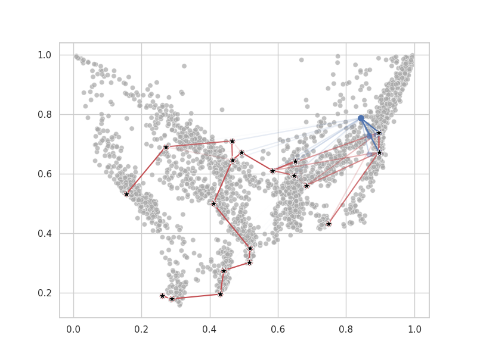

# Neural algorithmic reasoning for pseudotime trajectory inference

An end-to-end differentiable model for trajectory inference involving a neural minimum spanning tree solver.




## The structure of this program

This project contains several submodules. These include
* **expression_matrix_encoder** - An encoder and clusterer for scRNA-seq data
* **neural_execution_engine** - A GNN minimum spanning tree solver trained to mimic the execution of Prim's algorithm
* **losses** - Loss functions for training the trajectory inference method in an end-to-end differentiable manner 
* **utils** - utlity functions for the system, including graph utilities and plotting capabilities
* **linalg** - utilities for linear algebra, especially projecting points to lines
* **benchmaking** - Suite for benchmarking the model against 3 comparison models, some of the code is from the VITAE model https://github.com/jaydu1/VITAE

## Run the models

To run the model, edit the config objects in `config.py`. The `config.py` file contains objects that control the execution of the program.

```py

@dataclass
class DataConfig:
    name:                   str                    = EXPERIMENT_NAME

@dataclass
class EncoderClusterConfig:
    name:                   str                    = EXPERIMENT_NAME
    n_epochs:               int                    = 150
    learning_rate:          float                  = 1e-4
    clust_loss_coef:        float                  = 3.5
    recon_loss_coef:        float                  = 1.

    load_model:             bool                   = False
    load_autoencoder_from:  Optional[str]          = None
    load_clustering_from:   Optional[str]          = None
    save_autoencoder_to:    Optional[str]          = None
    save_clustering_to:     Optional[str]          = None


@dataclass
class NeuralExecutionConfig:
    name:                   str                    = EXPERIMENT_NAME
    n_nodes:                int                    = NUM_NODES
    emb_dim:                int                    = 32
    n_epochs:               int                    = 200
    n_data:                 int                    = 1000
    processor_in_channels:  int                    = 16
    node_features:          int                    = 1
    batch_size:             int                    = 1
    learning_rate:          float                  = 3e-4
    
    load_model:             bool                   = False
    train_model:            bool                   = True
    load_from:              Optional[str]          = None


@dataclass
class ExperimentConfig:
    name:                   str                    = EXPERIMENT_NAME
    latent_dimension:       int                    = LATENT_DIM
    n_centroids:            int                    = NUM_NODES
    n_epochs:               int                    = 10
    batch_size:             int                    = 128
    recon_loss_coef:        float                  = 2.
    mst_loss_coef:          float                  = 5.
    cluster_loss_coef:      float                  = 5.
    learning_rate:          float                  = 3e-4
    save_models:            bool                   = False
    plotting:               bool                   = False

    backbone_distance_coef: float                  = 1

    data_config:            DataConfig             = DataConfig()
    encoder_cluster_config: EncoderClusterConfig   = EncoderClusterConfig()
    neural_exec_config:     NeuralExecutionConfig  = NeuralExecutionConfig()
```

Then run
```
python3 train.py
```

To run the benchmarking, run
```
ipython benchmarking/run_and_evaluate_narti.py
```

## 